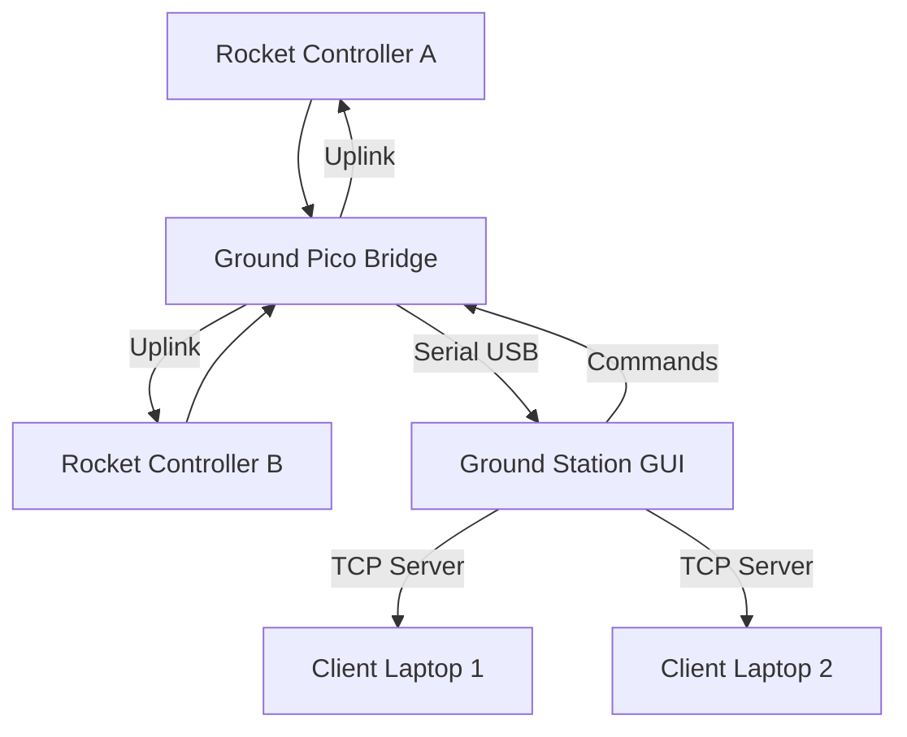

# Avio Pro Ground Station — Refactor Implementation Plan

## Architecture Overview



## Module Map (New)

| Module | File | Responsibility |
|--------|------|----------------|
| Telemetry Manager | `core/telemetry_manager.py` | Packet parsing, dual-controller buffers, state tracking |
| Controller Manager | `core/controller_manager.py` | A/B switching, alive flags, independent histories |
| Command Manager | `core/command_manager.py` | Uplink commands, ACKs, retry queue |
| Connection Manager | `core/connection_manager.py` | Serial connection, reconnect, status |
| Network Manager | `core/network_manager.py` | TCP telemetry sharing server |
| Mission State Manager | `core/mission_state.py` | FSM tracking, mission timer, state transitions |
| Debug Manager | `core/debug_manager.py` | System health evaluation, status messages |
| Logging Manager | `core/logging_manager.py` | Enhanced CSV with metadata, mission folders |
| Map Manager | `gui/map_window.py` | Leaflet map in webview, GPS trail |
| Gauge Widget | `gui/gauge_widget.py` | Animated aerospace gauges |
| Timeline Widget | `gui/timeline_widget.py` | Curved mission arc (REWRITE) |
| Main Window | `gui/main_window.py` | Complete UI layout (REWRITE) |
| Data Card | `gui/data_card.py` | Styled telemetry cards (RESTYLE) |
| Plots | `gui/plots.py` | **PRESERVED — no changes** |
| Animation Widget | `gui/animation_widget.py` | **PRESERVED — no changes** |
| PDF Generator | `core/pdf_generator.py` | **PRESERVED — minor adapter** |
| Video Saver | `core/video_saver.py` | **PRESERVED — no changes** |

## Phases

### Phase 1 — Core Architecture
1. New packet parser for dual-controller struct
2. Telemetry manager with A/B buffers
3. Controller manager with switching logic
4. Updated calculations engine
5. Mission state manager

### Phase 2 — UI Refactor
1. New dark.qss with aerospace aesthetics
2. Gauge widgets (altitude, velocity, acceleration)
3. Curved mission timeline
4. Redesigned main_window layout
5. Branding cards
6. Debug/status panel
7. Connection panel
8. Controller C1/C2 toggle

### Phase 3 — Communication & Networking
1. Bidirectional command manager
2. Connection manager with reconnect
3. TCP telemetry sharing server
4. Map window with Leaflet

### Phase 4 — Polish
1. Fault-tolerant error handling
2. Enhanced CSV logging
3. Requirements.txt update

## Preserved Systems (DO NOT MODIFY)
- `gui/plots.py` — LivePlot class
- `gui/animation_widget.py` — 3D rocket animation
- `core/video_saver.py` — Video export
- `core/pdf_generator.py` — PDF reports (minor adapter only)

## New Packet Structure Mapping
```
time_ms → timestamp
A_ax,A_ay,A_az → Controller A acceleration
A_gx,A_gy,A_gz → Controller A gyroscope
A_roll,A_pitch,A_yaw → Controller A orientation
A_lat,A_lon,A_gps_alt → Controller A GPS
A_baro_alt → Controller A barometric altitude
A_pressure, A_temperature → Controller A environment
A_voltage, A_current → Controller A power
A_state, A_apogee → Controller A mission state
B_ax,B_ay,B_az → Controller B acceleration
B_baro_alt → Controller B barometric altitude
B_pressure, B_temperature → Controller B environment
B_voltage → Controller B power
B_state, B_apogee → Controller B mission state
system_flags → System status bits
packet_id → Packet counter
crc → CRC (computed by Ground Pico, not GUI)
```
