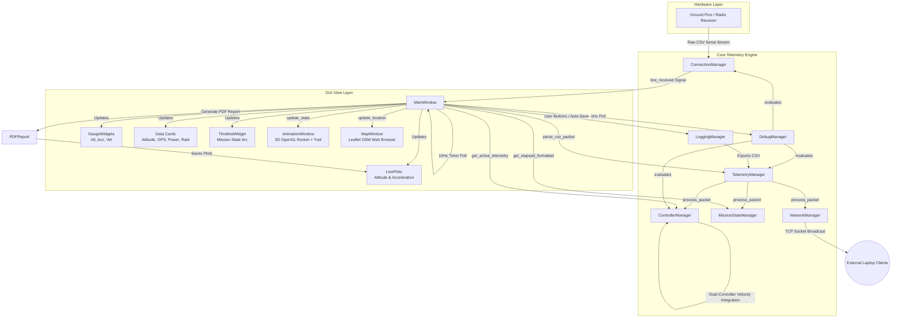

# Ground Station GUI Project Analysis & Architecture Summary

This document provides a comprehensive audit of the **DJS Impulse Ground Station** codebase. It identifies obsolete, unused files that can be safely archived or deleted, and offers a detailed architectural overview of how the remaining active files collaborate to build the ground station telemetry and GUI system.

---

## 1. Audit of Unused & Obsolete Files

Over the course of development, several modules were superseded by more robust dual-controller implementations. The following **7 source files** are currently completely unused and can be safely removed:

| File Path | Description | Reason for Obsolescence & Replacement |
| :--- | :--- | :--- |
| [`core/calculations.py`](file:///c:/Users/HARSHIT/Desktop/FLight_GUI/core/calculations.py) | `CalculationsEngine` | **Obsolete.** Velocity integration logic has been integrated directly into the `ControllerState` class within [`core/controller_manager.py`](file:///c:/Users/HARSHIT/Desktop/FLight_GUI/core/controller_manager.py) to keep controller-specific states consolidated. |
| [`core/csv_exporter.py`](file:///c:/Users/HARSHIT/Desktop/FLight_GUI/core/csv_exporter.py) | `CSVExporter` | **Obsolete.** Superseded by [`core/logging_manager.py`](file:///c:/Users/HARSHIT/Desktop/FLight_GUI/core/logging_manager.py)'s `LoggingManager`, which supports structured dual-controller data headers, checkpoint exports, and formatted folder hierarchies. |
| [`core/flight_buffer.py`](file:///c:/Users/HARSHIT/Desktop/FLight_GUI/core/flight_buffer.py) | `FlightBuffer` | **Obsolete.** Replaced by `ControllerBuffer` defined directly inside [`core/telemetry_manager.py`](file:///c:/Users/HARSHIT/Desktop/FLight_GUI/core/telemetry_manager.py) to manage independent Histories for Controllers A and B. |
| [`core/packet_parser.py`](file:///c:/Users/HARSHIT/Desktop/FLight_GUI/core/packet_parser.py) | `PacketParser` | **Obsolete.** Legacy parser limited to single-controller 14-field packets. Replaced by the much more robust `parse_csv_packet` and `parse_binary_packet` routines in [`core/telemetry_manager.py`](file:///c:/Users/HARSHIT/Desktop/FLight_GUI/core/telemetry_manager.py). |
| [`core/serial_worker.py`](file:///c:/Users/HARSHIT/Desktop/FLight_GUI/core/serial_worker.py) | `SerialWorker` | **Obsolete.** The active serial communication class `ConnectionManager` implements its own internal multi-threaded reader `SerialReaderThread` in [`core/connection_manager.py`](file:///c:/Users/HARSHIT/Desktop/FLight_GUI/core/connection_manager.py). |
| [`core/state_machine.py`](file:///c:/Users/HARSHIT/Desktop/FLight_GUI/core/state_machine.py) | Empty File | **Unused.** Fully empty (0 bytes) file. State logic is handled by [`core/mission_state.py`](file:///c:/Users/HARSHIT/Desktop/FLight_GUI/core/mission_state.py). |
| [`core/video_saver.py`](file:///c:/Users/HARSHIT/Desktop/FLight_GUI/core/video_saver.py) | `VideoSaver` (QThread) | **Unused.** Although imported by `main_window.py`, it is never instantiated or run. Rocket 3D animation video encoding is handled synchronously in the main/rendering thread of `AnimationWindow.save_video` inside [`gui/animation_widget.py`](file:///c:/Users/HARSHIT/Desktop/FLight_GUI/gui/animation_widget.py). |

---

## 2. Core System Architecture & Data Flow

The ground station GUI is designed around a **Model-View-Controller (MVC) style telemetry architecture** supporting a dual-controller system (Controller A & Controller B). 

Here is how data flows through the ground station in real-time:



---

## 3. How the Active Files Work and Connect

The ground station app boots via [`main.py`](file:///c:/Users/HARSHIT/Desktop/FLight_GUI/main.py) which sets the global application skin via [`styles/dark.qss`](file:///c:/Users/HARSHIT/Desktop/FLight_GUI/styles/dark.qss) and instantiates the [`MainWindow`](file:///c:/Users/HARSHIT/Desktop/FLight_GUI/gui/main_window.py). 

Below is an in-depth breakdown of the active system modules:

### A. The Core Control Hub (`core/`)

1. **[`core/telemetry_manager.py`](file:///c:/Users/HARSHIT/Desktop/FLight_GUI/core/telemetry_manager.py): Central Telemetry Coordinator**
   * **Role:** Parses incoming binary or CSV packet payloads (designed to handle both legacy 14-field telemetry and the modern 31+ field dual-controller structures).
   * **Connection:** Hosts the independent history buffers `buffer_a` and `buffer_b` for the dual controllers and tracks global connection stats like telemetry data-rates (Hz) and packet latency (ms).

2. **[`core/connection_manager.py`](file:///c:/Users/HARSHIT/Desktop/FLight_GUI/core/connection_manager.py): Serial Communication Engine**
   * **Role:** Spawns a background `SerialReaderThread` that auto-scans COM ports to detect the Ground Pico board, establishing serial connection at 115200 baud, and auto-reconnecting on signal drops.
   * **Connection:** Emits the raw `line_received` signal caught by `MainWindow` to drive telemetry ingestion.

3. **[`core/controller_manager.py`](file:///c:/Users/HARSHIT/Desktop/FLight_GUI/core/controller_manager.py): Telemetry State Isolator**
   * **Role:** Tracks individual physical properties (`alive`, `voltage`, `temperature`, `FSM state`, and `apogee`) for Controller A and B independently. In addition, it integrates acceleration in 3-dimensions over time using the trapezoidal integration rule to compute instant velocity values.
   * **Connection:** Provides `get_active_telemetry()` to the main UI loop, dynamically resolving which telemetry stream (A or B) to deliver depending on the active selection toggled on the UI strip.

4. **[`core/mission_state.py`](file:///c:/Users/HARSHIT/Desktop/FLight_GUI/core/mission_state.py): Flight Event Tracker**
   * **Role:** Detects structural flight events such as liftoff, apogee, parachute deployment, and landing based on active state transitions (e.g. state `3: ASCENT`, `4: PAYLOAD_SEP`, `7: IMPACT`). It also manages the mission timer clock.
   * **Connection:** Informs the timeline widget and feeds the PDF report generator with exact timestamps of crucial landing events.

5. **[`core/debug_manager.py`](file:///c:/Users/HARSHIT/Desktop/FLight_GUI/core/debug_manager.py): Intelligent Health Auditor**
   * **Role:** Evaluates system telemetry flags once a second to construct warning alerts. It audits low voltage thresholds (< 3.3V), weak radio signals (< -90dB), GPS lock failures, logging malfunctions, and offline controllers.
   * **Connection:** Dynamically colors and updates the status label in the Top Strip of `MainWindow` (green for nominal, amber for warnings, and red for critical faults).

6. **[`core/network_manager.py`](file:///c:/Users/HARSHIT/Desktop/FLight_GUI/core/network_manager.py): Multi-Laptop TCP Broadcast**
   * **Role:** Spawns a TCP server (`TelemetryServer` listening on port `5555`) to broadcast JSON-formatted telemetry streams in real-time to any connected ground laptops.
   * **Connection:** Automatically forwards every incoming packet processed by `MainWindow`.

7. **[`core/logging_manager.py`](file:///c:/Users/HARSHIT/Desktop/FLight_GUI/core/logging_manager.py): Mission Log Exporter**
   * **Role:** Formats and writes CSV records with modern dual-controller headers, organizing directories by unique flight folders under `exports/`.
   * **Connection:** Triggered manually via the "Save Checkpoint" / "Download CSV" buttons, or triggered automatically upon mission landing detection.

8. **[`core/pdf_generator.py`](file:///c:/Users/HARSHIT/Desktop/FLight_GUI/core/pdf_generator.py): PDF Flight Report Compiler**
   * **Role:** Compiles a professional flight report (`flight_report.pdf`) incorporating calculated stats, Google Maps links for the landing coordinates, FSM state progress, and visual telemetry curves.
   * **Connection:** Commands the PyQTGraph plots to export high-definition snapshots (`acc_plot.png` and `height_plot.png`) and merges them into the PDF.

9. **[`core/command_manager.py`](file:///c:/Users/HARSHIT/Desktop/FLight_GUI/core/command_manager.py): Uplink Telecommand Engine**
   * **Role:** Handles telecommand uplinks to command the rocket (e.g. sensor zeroing, radio triggers) with transmission queues, timeouts, and automatic retry sequences.

---

### B. The Graphical Interface Layer (`gui/`)

The layout of the dashboard is cleanly integrated into a single scrollable grid:

```
┌────────────────────────────────────────────────────────────────────────┐
│ [Time T+00.00]   [Status Message]          (C1) (C2)   [Impulse Logo]  │ <-- Top Strip
├─────────────────┬─────────────────────────┬────────────────────────────┤
│ ┌─────────────┐ │  ┌───────────────────┐  │  ┌──────────────────────┐  │
│ │   ALTITUDE  │ │  │ Timeline Progress │  │  │   Live Plot: Baro    │  │ <-- Middle Section
│ ├─────────────┤ │  └───────────────────┘  │  ├──────────────────────┤  │
│ │ ACCELERATION│ │  ┌──────┐ ┌──────────┐  │  │   Live Plot: Accel   │  │
│ ├─────────────┤ │  │ BTNS │ │Radio/Serv│  │  └──────────────────────┘  │
│ │   VELOCITY  │ │  └──────┘ └──────────┘  │                            │
│ └─────────────┘ │                         │                            │
├─────────────────┴─────────────────────────┴────────────────────────────┤
│ ┌──────────────┐ ┌──────────┐ ┌───────────┐ ┌──────────────┐            │
│ │   ATTITUDE   │ │   GPS    │ │   POWER   │ │  TELEMETRY   │            │ <-- Bottom Section
│ └──────────────┘ └──────────┘ └───────────┘ └──────────────┘            │
└────────────────────────────────────────────────────────────────────────┘
```

* **[`gui/main_window.py`](file:///c:/Users/HARSHIT/Desktop/FLight_GUI/gui/main_window.py): Application Shell**
  * Houses the primary UI layout, wires up managers to signals, running a `QTimer` at 10Hz to refresh the dashboard indicators with active controller metrics.
* **[`gui/timeline_widget.py`](file:///c:/Users/HARSHIT/Desktop/FLight_GUI/gui/timeline_widget.py): Curving Progress Bar**
  * Uses a Custom `QPainterPath` to render a parabolic arc representing the flight path. Flight nodes glow neon green upon reaching active states.
* **[`gui/gauge_widget.py`](file:///c:/Users/HARSHIT/Desktop/FLight_GUI/gui/gauge_widget.py): Circular Instrument Dial**
  * Uses custom vector rendering to draw beautiful radial dials displaying active telemetry values alongside the highest peak (max) recorded during the session.
* **[`gui/plots.py`](file:///c:/Users/HARSHIT/Desktop/FLight_GUI/gui/plots.py): Live Multiline Graphing**
  * Draws accelerated real-time telemetry plots for altitude (GPS/Baro curves) and accelerations ($A_x$, $A_y$, $A_z$) using lightweight PyQTGraph primitives.
* **[`gui/data_card.py`](file:///c:/Users/HARSHIT/Desktop/FLight_GUI/gui/data_card.py): Stat Display Grid**
  * Formats tabular textual indicators into structured grid cards.
* **[`gui/animation_widget.py`](file:///c:/Users/HARSHIT/Desktop/FLight_GUI/gui/animation_widget.py): Real-Time 3D Viewport**
  * Spawns a 3D OpenGL viewport displaying a rendered rocket assembly (nose cone, cylinder body, rocket nozzle, fins, parachute, and launch rail). Smooths roll/pitch/yaw/height metrics into a moving model and draws a 3D trajectory trail. Captures and encodes the viewport directly into an MP4 flight recording upon request.
* **[`gui/map_window.py`](file:///c:/Users/HARSHIT/Desktop/FLight_GUI/gui/map_window.py): Live Geographic Tracking**
  * Utilizes `QWebEngineView` to host Leaflet JS mapped against OpenStreetMap coordinates. Dynamically scripts JS calls to paint the rocket position and trace its trajectory in real-time.
